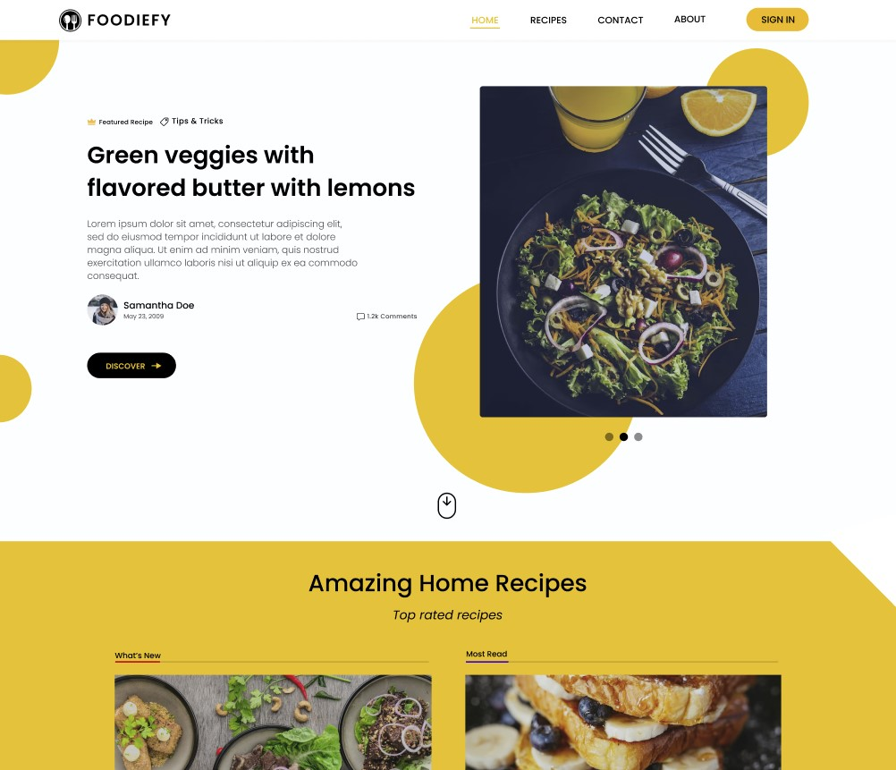

# Foodiefy

## Description

Foodiefy is a social platform for food enthusiasts where people can share pictures of food and recipes. Users can browse the latest food posts, follow other users, and save their favorite recipes to their profile.

## Features

- Share food pictures and recipes
- Browse latest food posts
- Follow other users
- Save favorite recipes
- Search for specific recipes or ingredients
- Like and comment on food posts

## Frontend Technologies

- Vite
- React
- TypeScript
- Tailwind CSS
- Notistack

## Backend Technologies

- NestJS
- TypeORM
- AWS S3

## Deployment

The app will be deployed on Netlify.

## Installation

1. Clone the repository
2. Install frontend dependencies with `npm install` in the `client` directory
3. Start the frontend server with `npm run dev` in the `client` directory
4. Install backend dependencies with `npm install` in the `server` directory
5. Start the backend server with `npm run start` in the `server` directory
6. Open `localhost:3000` in your browser

## Contributing

Contributions are welcome! Please open an issue or submit a pull request.

## License

This project is licensed under the MIT License. See the [LICENSE](https://github.com/yourusername/foodiefy/blob/main/LICENSE) file for details.

## Contact

For questions or support, please contact us at support@foodiefy.com.
